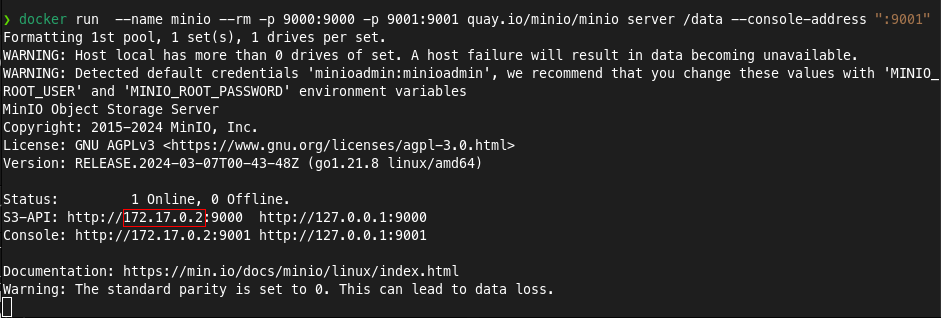

# Object Storage

## MinIO

### Para rodar MinIO

```BASH
docker run  --name minio --rm -p 9000:9000 -p 9001:9001 quay.io/minio/minio server /data --console-address ":9001"
```

[Acesse UI aqui](http://localhost:9001)

#### IP interno Docker




#### Python

[Run Python](./python_atividade_01_aula.md)

### mc: MinIO CLI

```BASH
docker run -it --entrypoint /bin/sh minio/mc

# Adiciona a conexão com o nome my-minio
#            ALIAS    HOSTNAME                         ACCESS_KEY SECRET_KEY
mc alias set my-minio http://<internal-docker-ip>:9000 minioadmin minioadmin

# Para testar conexão
mc admin info my-minio

# criar um bucket
mc mb my-minio/my-first-bucket

# criar um arquivo para testar
echo "meu primeiro arquivo para subir no minIO" > my-first-file.txt

#     SOURCE        TARGET  
mc cp ./my-first-file.txt my-minio/my-first-bucket/my-first-file-uploaded.txt

# Listar aquivos no bucket
mc ls my-minio/my-first-bucket
```

[Command Quick Reference](https://min.io/docs/minio/linux/reference/minio-mc.html#id4)
